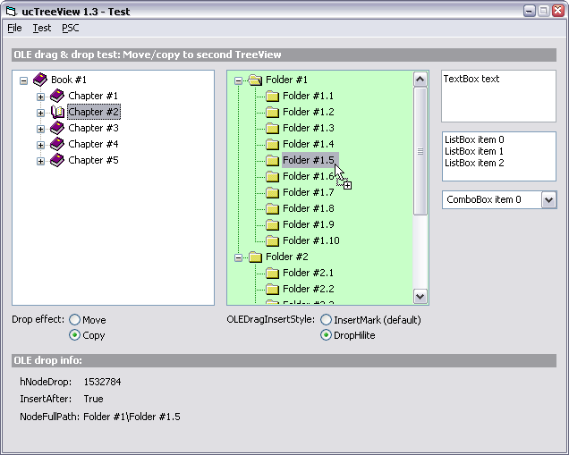



## API\-ucTreeView 1\.3 \(OLE Drag &amp; Drop support\)

### Description

New update: OLE Drag &amp; Drop support. // Most part of new code is based on vbAccelerator's TreeView control. Some new methods and properties have been added, too (see control History for more info). // Let me know about any bug, suggestion. 

----

Update #1: Added CheckChildren() method (hereditary checking) // Fixed: NodeDblClick not raised when DblClick on 'CheckBox'. Also node not expanded/collapsed. // For folder-explorer implementation, see CodeId=56432. 

----

Update #2: Unicode.
 
### More Info
 

             |
---                |---
**Submitted On**   |2004-11-03 16:13:44
**By**             |[Carles P\.V\.](https://github.com/Planet-Source-Code/PSCIndex/blob/master/ByAuthor/carles-p-v.md)
**Level**          |Intermediate
**User Rating**    |5.0 (165 globes from 33 users)
**Compatibility**  |VB 6\.0
**Category**       |[Custom Controls/ Forms/  Menus](https://github.com/Planet-Source-Code/PSCIndex/blob/master/ByCategory/custom-controls-forms-menus__1-4.md)
**World**          |[Visual Basic](https://github.com/Planet-Source-Code/PSCIndex/blob/master/ByWorld/visual-basic.md)
**Archive File**   |[API\-ucTree1887935132005\.zip](https://github.com/Planet-Source-Code/carles-p-v-api-uctreeview-1-3-ole-drag-amp-drop-support__1-57047/archive/master.zip)

